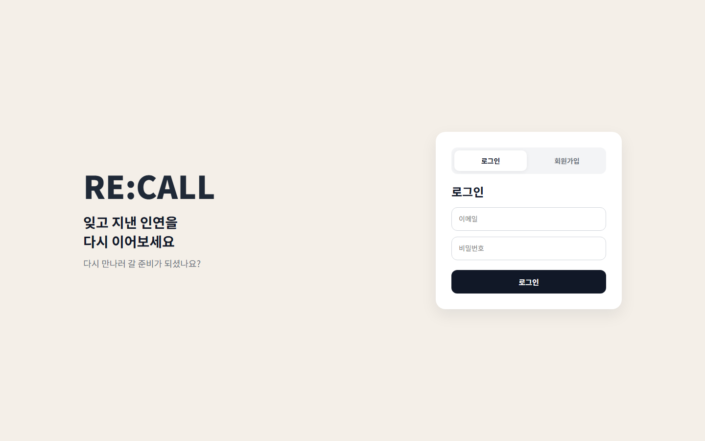
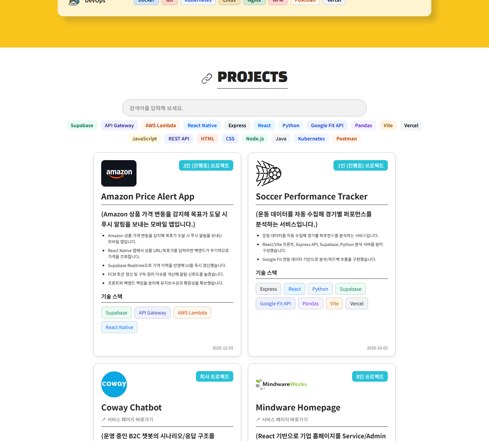

### 정재원 | FE

안녕하세요. 같은 문제를 두 번 고치기 싫어 구조부터 먼저 생각하는 프론트엔드 개발자 정재원입니다.
기능을 붙이는 속도보다 나중에도 덜 흔들리는 흐름을 만드는 일을 더 중요하게 생각합니다.

인증 흐름 · 상태 관리 · 라우팅 분기 · API 연동 · 운영 이슈 대응

[포트폴리오 웹앱](https://aes-portfolio-app.vercel.app/#about) | [GitHub](https://github.com/wonis1) | [wjdwo2808@gmail.com](mailto:wjdwo2808@gmail.com)

---

### 대표 프로젝트

  
<strong>RE:CALL | </strong>동창생 탐색 프로젝트

   
  

동창생 탐색 웹 서비스 · 4인 팀, 프론트엔드 2명  
인증 상태와 학교 상태가 얽힌 화면 분기를 정리한 프로젝트

- 맡은 일: 인증 흐름, 전역 상태, 메인 화면 구조 구현
- 개선 결과: 화면 분기 기준을 분리해 수정 범위를 줄였고, 학교 검색에는 400ms 디바운스를 적용해 불필요한 조회를 줄였습니다.
- 기술: React, TypeScript, TanStack Query, Zustand, React Router, Vite, CSS Modules
- 링크: [GitHub 저장소](https://github.com/sw-2-2/recall-frontend) · [라이브 데모](https://recallhub.vercel.app/login?redirect=%2F)
 

  
<strong>AES Portfolio App | </strong>DB 연동 포트폴리오 웹앱 프로젝트

   
  

개인 포트폴리오 웹앱  
Markdown 문서와 화면 코드를 분리해 콘텐츠 수정 비용을 낮춘 프로젝트

- 맡은 일: 프로젝트/경력 데이터 구조 설계, Markdown 상세 렌더링, Supabase 연동, 배포
- 개선 결과: 상세 내용이 문서와 데이터 중심으로 반영되게 정리했고, 새 프로젝트를 추가하는 흐름도 단순화했습니다.
- 기술: React, TypeScript, Vite, React Router, TanStack Query, Supabase
- 링크: [GitHub 저장소](https://github.com/wonis1/AES-portfolio-app) · [라이브 데모](https://aes-portfolio-app.vercel.app/#about)

---

### 강점

- 운영 중인 서비스에서 화면만 보지 않고 요청과 로그까지 함께 봅니다.
- 인증 상태, 서버 상태, 선택 상태를 섞지 않고 역할별로 분리합니다.
- 고객사 요구사항을 전달하는 데서 멈추지 않고, 구현 단위로 정리해 개발 조직과 조율합니다.

---

### 경력

**MindWareService | 솔루션 엔지니어**  
2023.03 - 2025.08

- 챗봇·콜봇 구축과 운영 과정에서 프론트 화면 수정, API 연동, 시나리오 변경, 장애 대응 수행
- 고객사 문의를 단순 접수하지 않고 원인 구간을 먼저 정리한 뒤 내부 개발 조직과 조율
- 운영 가이드, 연동 문서 작성, 고객사 교육 수행

**주요 프로젝트**
- 우리카드 챗봇 프로젝트 | [서비스](https://pc.wooricard.com/dcpc/yh1/crd/crd01/H1CRD201S00.do)
- 코웨이 챗봇 구축 프로젝트 | [서비스](https://www.coway.com/cowayservice/cody/main)
- MindWareWorks 홈페이지 재구축 프로젝트 | [서비스](https://www.mindwareworks.com/)
- 유비케어 챗봇 프로젝트 | [서비스](https://www.ubcare.co.kr/)

---

### 기술

---

### 학력 및 교육

- 선문대학교 산업경영공학과 | 공학사 | 2016.03 - 2023.02
- 현대오토에버 모빌리티 SW 스쿨 3기 | 웹앱 과정 | 2025.12 - 2026.06 수료 예정
